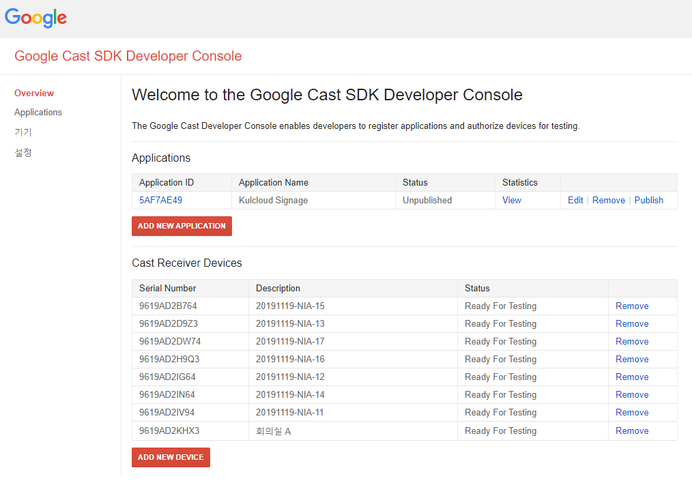
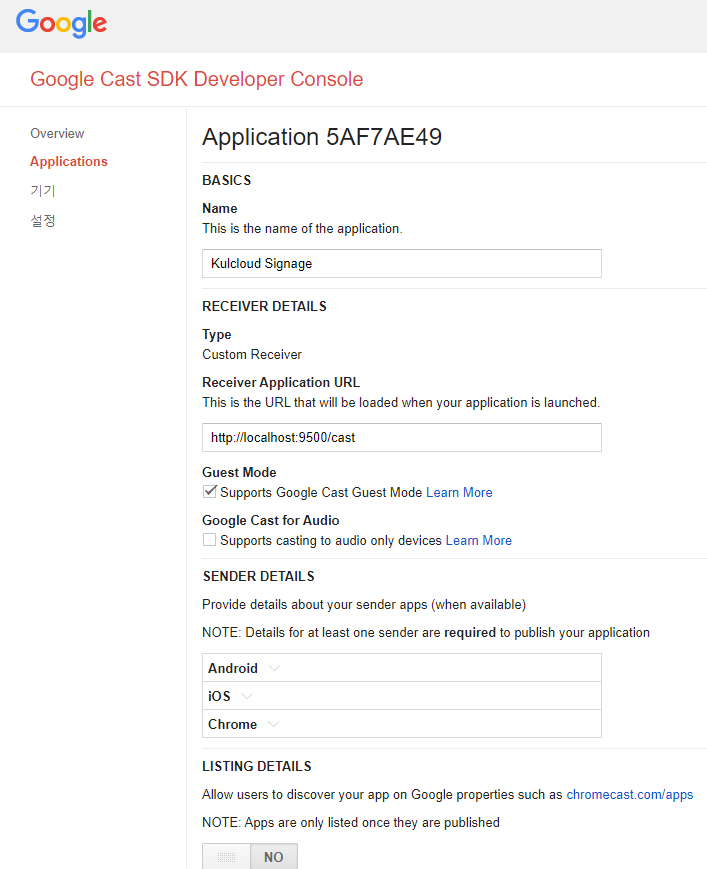

# signage-package

signage를 빌드하고 패키징을 하기 위해서는 build.bat 혹은 build.sh 파일을 실행한다.
 (참고로 파워쉘[윈도우즈] 혹은 터미널(리눅스)에서 이 파일이 있는 디렉터리로 이동 후 실행)
- 윈도우즈 
\> build.bat
 
- 리눅스 
\> build.sh

실행 이전에 다음과 같은 필요 소프트웨어가 필요하다.
- Wowza Streaming Engine
- MySQL 5.7 이상

MySQL을 설치하였으면 다음과 같이 2개의 스키마를 생성한다.
- signage-cms: signage-cms-xxx.jar 애플리케이션을 위한 스키마
- signage-kulcloud: signage-tenant-xxx.jar 애플리케이션을 위한 스키마

그리고 MySQL에 접속할 수 있는 계정을 application.properties에 설정한다.
- spring.datasource.username=root
- spring.datasource.userdata=xxxxxxxxx

Wowza Streaming Engine을 설치하였으면 호스트 정보를 application.properties에 설정한다.
- wowza.host:54.180.112.213

만약 signage-cms를 localhost가 아닌 다른 서버에 실행하였으면 다음과 같이 추가적으로 설정한다.
- com.kulcloud.signage.publicServerUrl=http://xxx.xxx.xxx.xxx:9500

설정이 끝나면 다음과 같이 애플리케이션을 실행한다.

- signage-cms 
\> java -jar signage-cms-xxx.jar

- signage-tenant 
\> java -jar signage-tenant-xxx.jar

실행이 성공적으로 수행되면 브라우저로 각각 UI에 접근 가능하다.
- signage-cms: http://localhost:9500
- signage-tenant: http://localhost:9400

(UI 사용법은 실증 보고서 문서를 참조)

[참고] 
Signage를 위한 크롬 캐스트의 Receiver APP은 signage-cms의 호스트와 연관되어 있으며 다음과 같은 URL로 크로 캐스트 개발 콘솔(구글에서 제공)에 크롬 캐스트의 시리얼 번호 등록과 함께 Receiver App이 등록되어 있어야 한다.
- receiver app: http://localhost:9500/cast/index.html
------------------------------------------------------

